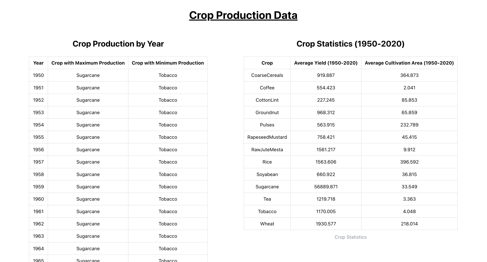

# Crop Production Analysis

This project displays crop production data in tables using React and Mantine.

## Getting Started

### Prerequisites

- Node.js installed
- Yarn package manager

### Installing

Clone the repository:
git clone https://github.com/ss-sahoo/crop-production-analysis.git

Install dependencies:
cd crop-production-analysis
yarn install

### Running the App

Start the development server:
yarn start
Open [http://localhost:3000](http://localhost:3000) to view it in your browser.

### Running Tests

To run tests, use:
yarn test

## Screenshots

## Built With

- [React](https://reactjs.org/) - JavaScript library for building user interfaces
- [Mantine](https://mantine.dev/) - React components and hooks library
